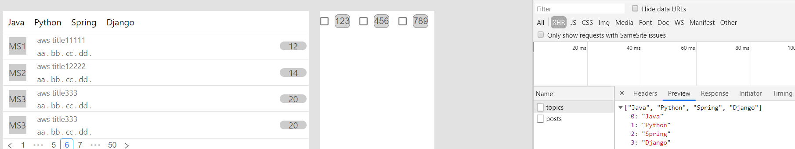

To run this project : 

### How to run it ?

Runs the app with command `yarn start` in the development mode.<br />
Open [http://localhost:3000](http://localhost:3000) to view it in the browser.

---

### Tech Stack

React + React Hooks + Redux + Redux-thunk + React-router

---

### Screenshots




---

### Backend

Simple Backend with Flask with fixed endpoint.

```
Step 1

> export FLASK_APP=backend.py # if ur in *nix environment

or

> set FLASK_APP=backend.py # if ur in Windows environemnt

Step 2

> flask run

```

# TODO

- [ ] use react-loadable to split the application into different parts and optimize the speed

- [ ] about useMemo/useCallback to optimize the application

- [ ] use eslint to formal all files


